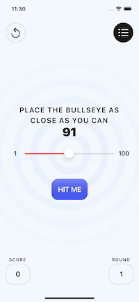
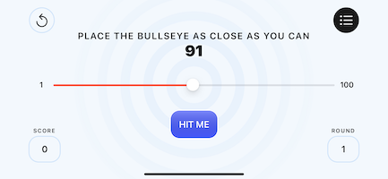
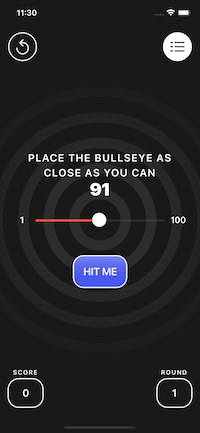
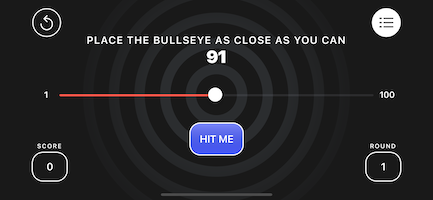

# Bullseye

Simple game where the user has to place the slider on the target value.

## Features

Built with SwiftUI and features light / dark mode.

## Requirements

To run the simulator, you will need Xcode, I use v13.1

## Demo

   

## Footnote

This app is apart of a course.
